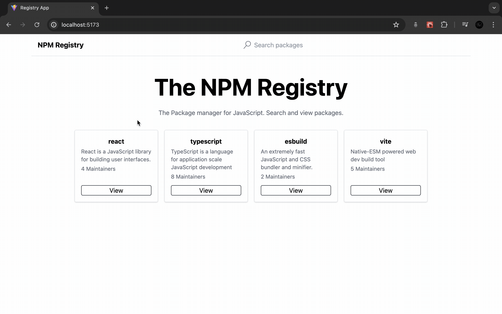

<h1>Registry App</h1>

## 📋 <a name="table">Table of Contents</a>

1. 🤖 [Introduction](#introduction)
2. ⚙️ [Tech Stack](#tech-stack)
3. 🔋 [Link to Page](#link-page)
4. 🛠️ [Improvements Ideas](#improvements)

## <a name="introduction">🤖 Introduction</a>

The challenge was to reimagine the NPM homepage, expand its functionality, and beautifully present API data on detail pages.

The development involved leveraging the power of React.js, React Router, Vite, and TypeScript, while incorporating the sleek styling capabilities of Tailwind CSS.

## <a name="tech-stack">⚙️ Tech Stack</a>

- HTML
- Tailwind CSS
- ReactJS
- React Router
- Vite
- TypeScript

## <a name="link-page">🔋 Link to Page</a>

- Live Site URL: [GitHub Page](https://mirkozlatunic.github.io/registry-app/)

## <a name="improvements">🛠️ Improvements Ideas</a>
